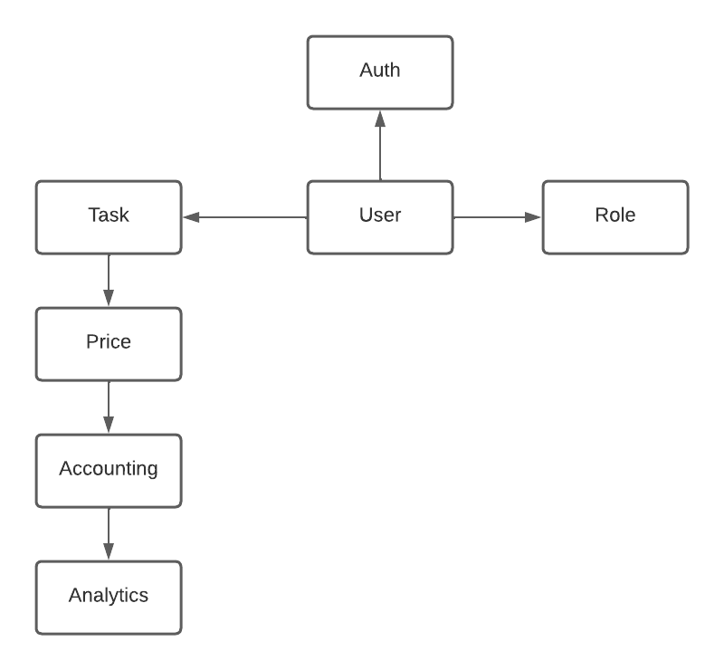
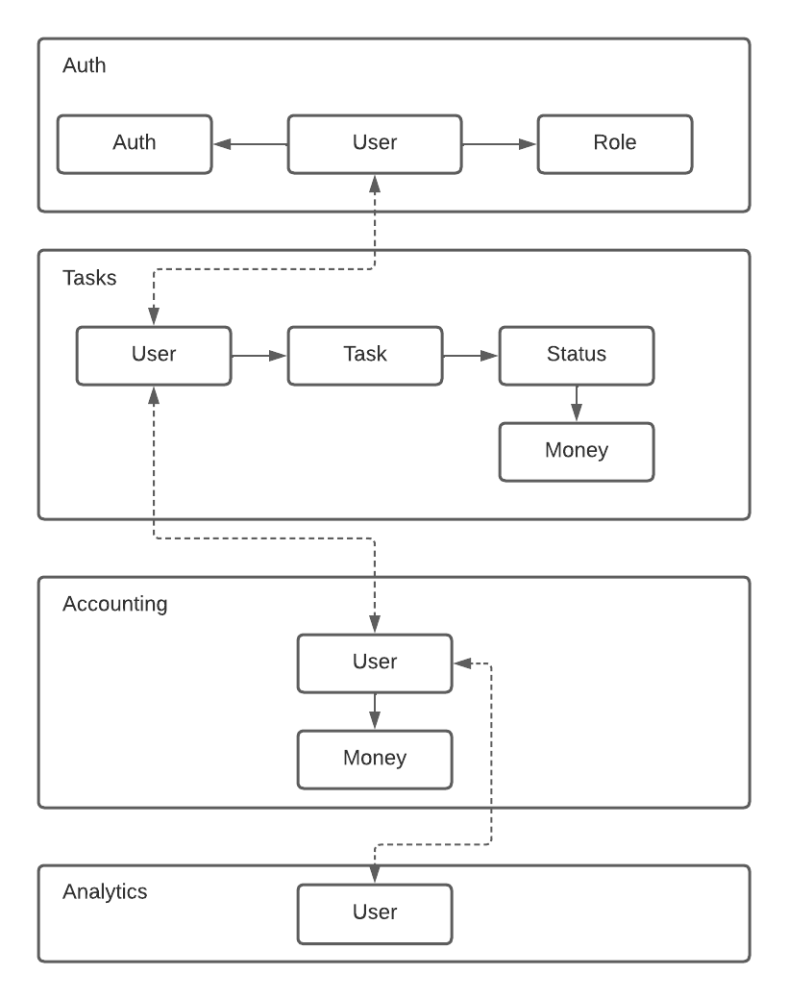

# Awesome Task Exchange System (aTES) for UberPopug Inc.

### Разбивка требований
1. Таск-трекер должен быть отдельным дашбордом и доступен всем сотрудникам компании UberPopug Inc.
- Actor: User
- Command: Login
- Data: User
- Event: Users.Logined

2. Новые таски может создавать кто угодно (администратор, начальник, разработчик, менеджер и любая другая роль). У задачи должны быть описание, статус (выполнена или нет) и попуг, на которого заассайнена задача.
- Actor: User
- Command: Create Task
- Data: Task
- Event: Tasks.Created

2.1. После создания таски происходит ее автоматический ассайн
- Actor: Tasks.Created event
- Command: Assign Task
- Data: Task
- Event: Tasks.Assigned

2.2. После ассайна таски происходит списание денег
- Actor: Tasks.Assigned event
- Command: User Withdraw Money
- Data: Money and User
- Event: Money.Withdrawed

2.3. Заверешние таски
- Actor: User
- Command: Complete Task
- Data: Task
- Event: Tasks.Completed

2.4. После завершения таски происходит начисление денег
- Actor: Tasks.Completed event
- Command: User Deposit Money
- Data: Money and User
- Event: Money.Deposited

3. Менеджеры или администраторы должны иметь кнопку «заассайнить задачи», которая возьмёт все открытые задачи и рандомно заассайнит каждую на любого из сотрудников (кроме менеджера и администратора) . Не успел закрыть задачу до реассайна — сорян, делай следующую.
- Actor: User with "Manager" or "Administrator" roles
- Command: Assign Open Tasks
- Data: Tasks
- Event: Tasks.Assigned

4. Каждый сотрудник должен иметь возможность видеть в отдельном месте список заассайненных на него задач.
- Actor: User
- Command: Get Open Tasks
- Data: User
- Event: Tasks.Showed

5. Аккаунтинг
- Actor: User
- Command: Get Statistic
- Data: User
- Event: Accounting.StatisticShowed

6. Аналитика
- Actor: User with "Admin" role
- Command: Get Money Statistic
- Data: User
- Event: Analytics.StatisticShowed

### Модель данных

### Модель доменов
